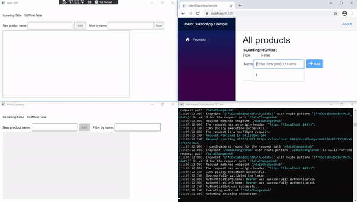

Data change notifications from Sql Server via [SqlTableDependency](https://github.com/christiandelbianco/monitor-table-change-with-sqltabledependency), [OData](https://docs.microsoft.com/en-us/odata/overview) and [Redis](https://github.com/StackExchange/StackExchange.Redis) to different [.NET](https://dotnet.microsoft.com/) clients ([WinUI3 - UWP and Win32 apps](https://microsoft.github.io/microsoft-ui-xaml/about.html#what-is-it), [WPF](https://github.com/dotnet/wpf), [Blazor Wasm](https://docs.microsoft.com/sk-sk/aspnet/core/blazor/?view=aspnetcore-5.0#blazor-webassembly), etc). Blazor Wasm notifications are redirected with [SignalR](https://dotnet.microsoft.com/apps/aspnet/signalr).



# ksqlDB.RestApi.Client push queries LINQ provider
This project was moved to a separate (repository ksqlDB.RestApi.Client)[https://github.com/tomasfabian/ksqlDB.RestApi.Client-DotNet]

This package generates ksql queries from your .NET C# linq queries. You can filter, project, limit, etc. your push notifications server side with [ksqlDB push queries](https://docs.ksqldb.io/en/latest/developer-guide/ksqldb-rest-api/streaming-endpoint/).
You can continually process computations over unbounded (theoretically never-ending) streams of data.
It also allows you to execute SQL [statements](https://docs.ksqldb.io/en/latest/developer-guide/ksqldb-reference/) via the Rest API like inserting records into streams and creating tables, types etc. or exucecute admin operations such as listing streams.

[ksqlDB.RestApi.Client](https://github.com/tomasfabian/ksqlDB.RestApi.Client-DotNet) is a contribution to [Confluent ksqldb-clients](https://docs.ksqldb.io/en/latest/developer-guide/ksqldb-clients/)

Install with NuGet package manager:
```
Install-Package ksqlDB.RestApi.Client
```
or with .NET CLI
```
dotnet add package ksqlDB.RestApi.Client
```
```C#
using System;
using ConsoleAppKsqlDB;
using ksqlDB.RestApi.Client.KSql.Linq;
using ksqlDB.RestApi.Client.KSql.Query.Context;
using ksqlDB.RestApi.Client.KSql.Query.Options;
using ksqlDB.RestApi.Client.Sample.Model;

var ksqlDbUrl = @"http:\\localhost:8088";

await using var context = new KSqlDBContext(ksqlDbUrl);

using var disposable = context.CreateQueryStream<Tweet>()
  .WithOffsetResetPolicy(AutoOffsetReset.Latest)
  .Where(p => p.Message != "Hello world" || p.Id == 1)
  .Select(l => new { l.Message, l.Id })
  .Take(2)
  .Subscribe(tweetMessage =>
  {
    Console.WriteLine($"{nameof(Tweet)}: {tweetMessage.Id} - {tweetMessage.Message}");
  }, error => { Console.WriteLine($"Exception: {error.Message}"); }, () => Console.WriteLine("Completed"));

Console.WriteLine("Press any key to stop the subscription");

Console.ReadKey();

namespace ConsoleAppKsqlDB
{
  public class Tweet : Record
  {
    public int Id { get; set; }

    public string Message { get; set; }
  }
}
```

# CDC - Push notifications from Sql Server tables with Kafka
Monitor Sql Server tables for changes and forward them to the appropriate Kafka topics. You can consume (react to) these row-level table changes (CDC - Change Data Capture) from Sql Server databases with SqlServer.Connector package together with the Debezium connector streaming platform. 
### Nuget
```
Install-Package SqlServer.Connector -Version 0.3.0
Install-Package ksqlDB.RestApi.Client
```

[SqlServer.Connector WIKI](https://github.com/tomasfabian/ksqlDB.RestApi.Client-DotNet/blob/main/SqlServer.Connector/Wiki.md)

Full example is available in [Blazor example](https://github.com/tomasfabian/ksqlDB.RestApi.Client-DotNet/tree/main/Samples/Blazor.Sample) - InsideOut.sln: (The initial run takes a few minutes until all containers are up and running.)

The following example demonstrates ksqldb server side filtering of database transactions: 
```C#
using System;
using System.Threading;
using System.Threading.Tasks;
using ksqlDB.RestApi.Client.KSql.Linq;
using ksqlDB.RestApi.Client.KSql.Query.Context;
using ksqlDB.RestApi.Client.KSql.Query.Options;
using SqlServer.Connector.Cdc;
using SqlServer.Connector.Cdc.Extensions;

class Program
{
  static string connectionString = @"Server=127.0.0.1,1433;User Id = SA;Password=<YourNewStrong@Passw0rd>;Initial Catalog = Sensors;MultipleActiveResultSets=true";

  static string bootstrapServers = "localhost:29092";
  static string KsqlDbUrl => @"http:\\localhost:8088";

  static string tableName = "Sensors";
  static string schemaName = "dbo";

  private static ISqlServerCdcClient CdcClient { get; set; }

  static async Task Main(string[] args)
  {
    CdcClient = new CdcClient(connectionString);

    await CreateSensorsCdcStreamAsync();

    await TryEnableCdcAsync();

    await CreateConnectorAsync();

    await using var context = new KSqlDBContext(KsqlDbUrl);

    var semaphoreSlim = new SemaphoreSlim(0, 1);

    var cdcSubscription = context.CreateQuery<IoTSensorChange>("sqlserversensors")
      .WithOffsetResetPolicy(AutoOffsetReset.Latest)
      .Where(c => c.Op != "r" && (c.After == null || c.After.SensorId != "d542a2b3-c"))
      .Take(5)
      .ToObservable()
      .Subscribe(cdc =>
        {
          var operationType = cdc.OperationType;
          Console.WriteLine(operationType);

          switch (operationType)
          {
            case ChangeDataCaptureType.Created:
              Console.WriteLine($"Value: {cdc.After.Value}");
              break;
            case ChangeDataCaptureType.Updated:

              Console.WriteLine($"Value before: {cdc.Before.Value}");
              Console.WriteLine($"Value after: {cdc.After.Value}");
              break;
            case ChangeDataCaptureType.Deleted:
              Console.WriteLine($"Value: {cdc.Before.Value}");
              break;
          }
        }, onError: error =>
        {
          semaphoreSlim.Release();

          Console.WriteLine($"Exception: {error.Message}");
        },
        onCompleted: () =>
        {
          semaphoreSlim.Release();
          Console.WriteLine("Completed");
        });


    await semaphoreSlim.WaitAsync();

    using (cdcSubscription)
    {
    }
  }

  private static async Task CreateSensorsCdcStreamAsync(CancellationToken cancellationToken = default)
  {
    string fromName = "sqlserversensors";
    string kafkaTopic = "sqlserver2019.dbo.Sensors";

    var ksqlDbUrl = Configuration[ConfigKeys.KSqlDb_Url];

    var httpClientFactory = new HttpClientFactory(new Uri(ksqlDbUrl));

    var restApiClient = new KSqlDbRestApiClient(httpClientFactory);

    EntityCreationMetadata metadata = new()
    {
      EntityName = fromName,
      KafkaTopic = kafkaTopic,
      ValueFormat = SerializationFormats.Json,
      Partitions = 1,
      Replicas = 1
    };

    var createTypeResponse = await restApiClient.CreateTypeAsync<IoTSensor>(cancellationToken);
    createTypeResponse = await restApiClient.CreateTypeAsync<IoTSensorChange>(cancellationToken);

    var httpResponseMessage = await restApiClient.CreateStreamAsync<DatabaseChangeObject<IoTSensor>>(metadata, ifNotExists: true, cancellationToken: cancellationToken)
      .ConfigureAwait(false);
  }
}

public record IoTSensorChange : DatabaseChangeObject<IoTSensor>
{
}

public record IoTSensor
{
  [Key]
  public string SensorId { get; set; }
  public int Value { get; set; }
}
```

# Joker Model-View-ViewModel:
Reactive view models for data changes

* [Joker.MVVM wiki](https://github.com/tomasfabian/SqlTableDependency.Extensions/wiki/Joker.MVVM)

Install-Package Joker.MVVM

# Joker OData:
Plumbing code for OData web services. Support for batching and end points. Please help out the community by sharing your suggestions and code improvements:
* [Joker.OData wiki](https://github.com/tomasfabian/SqlTableDependency.Extensions/wiki/Joker.OData)

# Preview:
[Redis TableDependency status notifier](https://github.com/tomasfabian/SqlTableDependency.Extensions/wiki/Redis-TableDependency-status-notifier---preview)
Sql server data changes refresher via Redis with End to end reconnections

# SqlTableDependency.Extensions
If sharing increases coupling, should we share at all? Is it time for decoupling?

I don't think so.

Please use data streaming and process it with the help of reactive programming and event driven paradigms. 

## Install:
https://www.nuget.org/packages/SqlTableDependency.Extensions/

Install-Package SqlTableDependency.Extensions

or

dotnet add package SqlTableDependency.Extensions --version 3.0.0

## See:
Following package is based on christiandelbianco's SqlTableDependency:
https://github.com/christiandelbianco/monitor-table-change-with-sqltabledependency

SqlTableDependency.Extension.SqlTableDependencyProvider provides periodic reconnections in case of any error, like lost connection etc.

Currently there are 3 LifetimeScopes:
## ConnectionScope:
In case that the connection is lost, database objects will be deleted after timeout period or during disposal. During all reconnections the database objects are newly (re)created.

## ApplicationScope:
In case that the connection is lost, database objects will be deleted only after timeout period. After reconnection the database objects are recreated in case that the conversation handle does not exist anymore. Otherwise the database objects are preserved and reused. If the application was closed the conversation will not continue after app restart. You shouldn't lost data changes within the timeout period. The messages will be delivered after the reconnection.

## UniqueScope:
In case that the connection is lost, database objects will be deleted only after timeout period. After reconnection the database objects are recreated only in case, that the conversation handle does not exist anymore. Otherwise the database objects are preserved and reused. If the application was closed and the conversation was not cleaned it will be reused after app restarts. You shouldn't lost data changes within the timeout period. The messages will be delivered after the reconnection.

[Wiki Samples](https://github.com/tomasfabian/SqlTableDependency.Extensions/wiki/Samples)

## Docker for external dependencies:
MS SQL Server 2017:
```
docker run --name sql -e "ACCEPT_EULA=Y" -e "SA_PASSWORD=<YourNewStrong@Passw0rd>" -p 1401:1433 -d mcr.microsoft.com/mssql/server:2017-latest
```
Redis latest:
```
docker run --name redis-server -p 6379:6379 -d redis
```

## Examples Entity Framework migrations:
Package Manager Console (Default project => Examples\Samples.Data):
```
Update-Database -ConnectionString "Server=127.0.0.1,1401;User Id = SA;Password=<YourNewStrong@Passw0rd>;Initial Catalog = Test;" -ConnectionProviderName "System.Data.SqlClient" -ProjectName Sample.Data -verbose
```
## Basic usage:

Enable Service Broker in MS SQL SERVER

```SQL
ALTER DATABASE [DatabaseName]
    SET ENABLE_BROKER WITH ROLLBACK IMMEDIATE;
```
// C#
```C#
  public class Product
  {
      public int Id { get; set; }
      public string Name { get; set; }
  } 
  
  using SqlTableDependency.Extensions;
  using SqlTableDependency.Extensions.Enums;
  
  internal class ProductsSqlTableDependencyProvider : SqlTableDependencyProvider<Product>
  {
    private readonly ILogger logger;

    internal ProductsSqlTableDependencyProvider(ConnectionStringSettings connectionStringSettings, IScheduler scheduler, ILogger logger)
      : base(connectionStringSettings, scheduler, LifetimeScope.UniqueScope)
    {
      this.logger = logger ?? throw new ArgumentNullException(nameof(logger));
    }

    internal ProductsSqlTableDependencyProvider(string connectionString, IScheduler scheduler, ILogger logger)
      : base(connectionString, scheduler, LifetimeScope.UniqueScope)
    {
      this.logger = logger ?? throw new ArgumentNullException(nameof(logger));
    }

    protected override ModelToTableMapper<Product> OnInitializeMapper(ModelToTableMapper<Product> modelToTableMapper)
    {
      modelToTableMapper.AddMapping(c => c.Id, nameof(Product.Id));

      return modelToTableMapper;
    }

    protected override void OnInserted(Product product)
    {
      base.OnInserted(product);

      logger.Trace("Entity was added");

      LogChangeInfo(product);
    }

    protected override void OnUpdated(Product product, Product oldValues)
    {
      base.OnUpdated(entity, oldValues);

      logger.Trace("Entity was modified");

      LogChangeInfo(product);
    }

    protected override void OnDeleted(Product product)
    {
      base.OnDeleted(product);

      logger.Trace("Entity was deleted");

      LogChangeInfo(product);
    }

    private void LogChangeInfo(Product product)
    {
      Console.WriteLine(Environment.NewLine);

      Console.WriteLine("Id: " + product.Id);
      Console.WriteLine("Name: " + product.Name);

      Console.WriteLine("#####");
      Console.WriteLine(Environment.NewLine);
    }
    
    protected override void OnError(Exception exception)
    {
      logSource.Error(exception);
    }
  }
```
//Program.cs
```C#
using System.Configuration;
using System.Reactive.Concurrency;

namespace SqlTableDependency.Extensions.Sample
{
  class Program
  {
    static void Main(string[] args)
    {
      var connectionString = ConfigurationManager.ConnectionStrings["FargoEntities"].ConnectionString;
      
      using var productsProvider = new ProductsSqlTableDependencyProvider(connectionString, ThreadPoolScheduler.Instance, new ConsoleLogger());
      productsProvider.SubscribeToEntityChanges();
      
      Console.ReadKey();
    }
  }
}

```

# Joker.Redis
SqlServer PubSub notifications via Redis and SqlTableDependencyProvider extension

Install-Package Joker.Redis

Download and run redis-server (https://redis.io/download) or use Docker (see above).

Server side:
```C#
public class ProductSqlTableDependencyRedisProvider : SqlTableDependencyRedisProvider<Product>
{
  public ProductSqlTableDependencyRedisProvider(ISqlTableDependencyProvider<Product> sqlTableDependencyProvider, IRedisPublisher redisPublisher) 
    : base(sqlTableDependencyProvider, redisPublisher)
  {
  }
}

```

```C#
string redisUrl = ConfigurationManager.AppSettings["RedisUrl"]; //localhost

var redisPublisher = new RedisPublisher(redisUrl);
await redisPublisher.PublishAsync("messages", "hello");

using var productsProvider = new ProductsSqlTableDependencyProvider(connectionString, ThreadPoolScheduler.Instance, new ConsoleLogger());

using var productSqlTableDependencyRedisProvider = new ProductSqlTableDependencyRedisProvider(productsProvider, redisPublisher, ThreadPoolScheduler.Instance)
  .StartPublishing();
```

Client side:
```C#
private static async Task<RedisSubscriber> CreateRedisSubscriber(string redisUrl)
{
  var redisSubscriber = new RedisSubscriber(redisUrl);

  await redisSubscriber.Subscribe(channelMessage => { Console.WriteLine($"OnNext({channelMessage.Message})"); },
  "messages");

  await redisSubscriber.Subscribe(channelMessage =>
  {
    var recordChange = JsonConvert.DeserializeObject<RecordChangedNotification<Product>>(channelMessage.Message);
    Console.WriteLine($"OnNext Product changed({recordChange.ChangeType})");
    Console.WriteLine($"OnNext Product changed({recordChange.Entity.Id})");
  }, nameof(Product) + "-Changes");

  await redisSubscriber.Subscribe(channelMessage =>
  {
    var tableDependencyStatus = JsonConvert.DeserializeObject<TableDependencyStatus>(channelMessage.Message);
    Console.WriteLine($"OnNext tableDependencyStatus changed({tableDependencyStatus})");
  }, nameof(Product) + "-Status");

  redisSubscriber.WhenIsConnectedChanges.Subscribe(c => Console.WriteLine($"REDIS is connected: {c}"));

  return redisSubscriber;
}
```

# How to put it all together
[Try out samples](https://github.com/tomasfabian/Joker/wiki/Samples)

```C#
    private static void CreateReactiveProductsViewModel()
    {
      var reactiveData = new ReactiveData<Product>();
      var redisUrl = ConfigurationManager.AppSettings["RedisUrl"];
      using var entitiesSubscriber = new DomainEntitiesSubscriber<Product>(new RedisSubscriber(redisUrl), reactiveData);

      string connectionString = ConfigurationManager.ConnectionStrings["FargoEntities"].ConnectionString;

      var reactiveProductsViewModel = new ReactiveProductsViewModel(new SampleDbContext(connectionString),
        reactiveData, new WpfSchedulersFactory());

      reactiveProductsViewModel.SubscribeToDataChanges();

      reactiveProductsViewModel.Dispose();
    }
```

[](https://www.buymeacoffee.com/tomasfabian)
